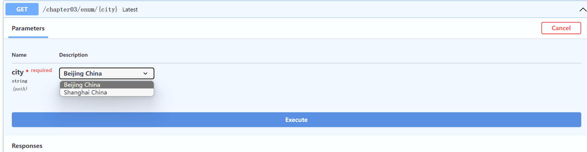

## FastApi 项目启动命令

uvicorn main:app --reload

## Union 的作用

**Union**[int, str] == [int or str], 表示既可以是 int，也可以是 str

```python
from typing import Union

from fastapi import FastAPI

app = FastAPI()


@app.get("/items/{item_id}")
async def read_item(item_id: str, q: Union[str, None] = None, short: bool = False):
    item = {"item_id": item_id}
    if q:
        item.update({"q": q})
    if not short:
        item.update(
            {"description": "This is an amazing item that has a long description"}
        )
    return item

```

## ...作用

源码：是一个不可继承的类

@final

class ellipsis: ...

Ellipsis: ellipsis

### 用法

- 函数内部：等于 pass

```python
def foo1(): pass
def foo2(): ...
```

- 用于切片，灵活表示多维度的行列，例如 a = a[...]， a[ ..., 0 : 2] = a[ : , : , 0 : 2]

```python
import numpy as np

x = np.arange(24)
a = x.reshape(2, 3, 4)

print(a) # a[...]
print('a.shape', a.shape)
print('----------------------')

b = a[..., 0]  # 针对的是最后一个维度的下标为0的元素, 等价于 a[:, :, 0]
print(b)
print('b.shape', b.shape)
print('----------------------')

c = a[..., 0:2]  # 针对的是最后一个维度的下标为0、1的元素,  等价于 a[:, :, 0:2]
print(c)
print('c.shape', c.shape)
print('----------------------')

----------------------
[[[ 0  1  2  3]
  [ 4  5  6  7]
  [ 8  9 10 11]]

 [[12 13 14 15]
  [16 17 18 19]
  [20 21 22 23]]]
a.shape (2, 3, 4)
----------------------
[[ 0  4  8]
 [12 16 20]]
b.shape (2, 3)
----------------------
[[[ 0  1]
  [ 4  5]
  [ 8  9]]

 [[12 13]
  [16 17]
  [20 21]]]
c.shape (2, 3, 2)
----------------------
```

- flask 中表示必须的参数

```python
from fastapi import FastAPI, Query

app = FastAPI()


@app.get("/items/")
async def read_items(q: str = Query(..., min_length=3)):
    results = {"items": [{"item_id": "Foo"}, {"item_id": "Bar"}]}
    if q:
        results.update({"q": q})
    return results

```

## Enum，枚举类型，下拉框显示

```python
class CityName(str, Enum):
    Beijing = "Beijing China"
    Shanghai = "Shanghai China"


@app03.get("/enum/{city}")  # 枚举类型的参数
async def latest(city: CityName):
    if city == CityName.Shanghai:
        return {"city_name": city, "confirmed": 1492, "death": 7}
    if city.value == "Beijing China":
        return {"city_name": city, "confirmed": 971, "death": 9}
    return {"city_name": city, "latest": "unknown"}
```



## 查询参数

http://127.0.0.1:8000/items/?q=1

http://127.0.0.1:8000/items/?q=on

http://127.0.0.1:8000/items/?q=true

http://127.0.0.1:8000/items/?q=yes

```python
from typing import Union

from fastapi import FastAPI, Query

app = FastAPI()


@app.get("/items/")
async def read_items(q: Union[str, None] = Query(default=None, alias="item-query")):
    results = {"items": [{"item_id": "Foo"}, {"item_id": "Bar"}]}
    if q:
        results.update({"q": q})
    return results

```

## 路径参数

http://127.0.0.1:8000/items/1

```python
from fastapi import FastAPI, Path

app = FastAPI()


@app.get("/items/{item_id}")
async def read_items(item_id: int = Path(title="The ID of the item to get", gt=1, le=10), q: str):
    results = {"item_id": item_id}
    if q:
        results.update({"q": q})
    return results

```

## \*的作用，使得**后面的所有参数都应作为关键字参数（键值对），也被称为 kwargs，来调用。即使它们没有默认值。**

http://127.0.0.1:8000/chapter03/items/1?q=str

```python
@app03.get('/items/{item_id}')
async def read_items(
    # Python 不会对该 * 做任何事情，但是它将知道之后的所有参数都应作为关键字参数（键值对），也被称为 kwargs，来调用。即使它们没有默认值。
    *, item_id: int = Path(..., title="The ID of the item to get"), q: str
):
    results = {"item_id": item_id}
    if q:
        results.update({"q": q})
    return results
```

## alias 别名参数

```python
# http://127.0.0.1:8000/items/?item-query=foobaritems

from typing import Union

from fastapi import FastAPI, Query

app = FastAPI()


@app.get("/items/")
async def read_items(q: Union[str, None] = Query(default=None, alias="item-query")):
    results = {"items": [{"item_id": "Foo"}, {"item_id": "Bar"}]}
    if q:
        results.update({"q": q})
    return results
```

## 路径转换器

/files/{file_path:path}

`path` 说明该参数应匹配任意的 _路径_ 。

你可能会需要参数包含 `/home/johndoe/myfile.txt`，以斜杠（`/`）开头。

在这种情况下，URL 将会是 `/files//home/johndoe/myfile.txt`，在 `files` 和 `home` 之间有一个双斜杠（`//`）。

```python
from fastapi import FastAPI

app = FastAPI()


@app.get("/files/{file_path:path}")
async def read_file(file_path: str):
    return {"file_path": file_path}
```
